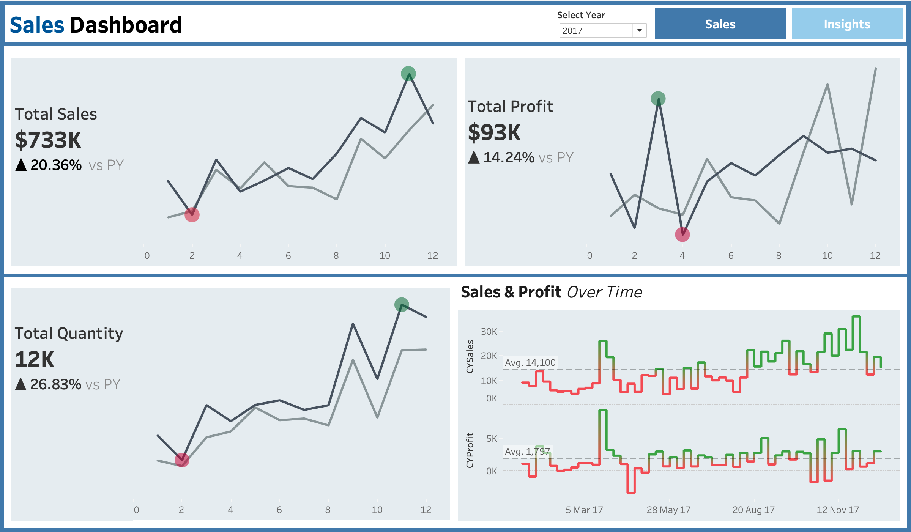
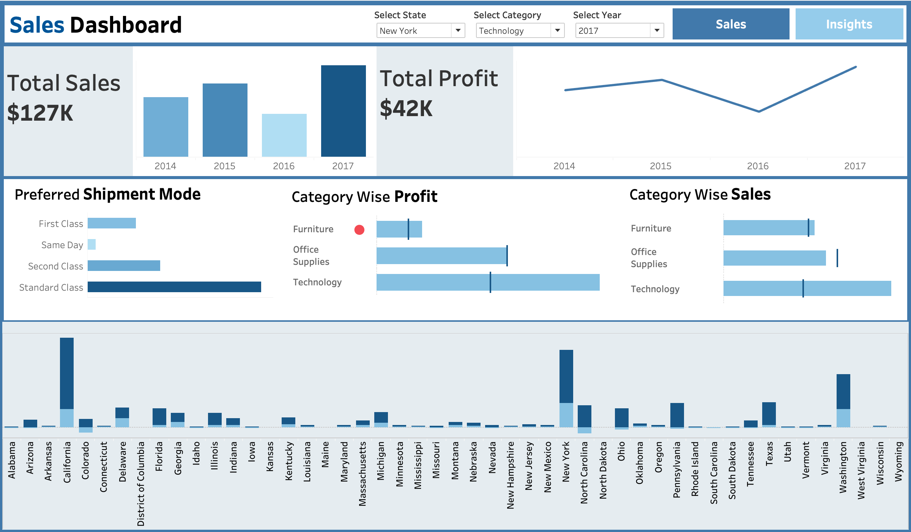

# Sales Performance Analysis Dashboard

## Overview
This project showcases an interactive Tableau dashboard built to analyze sales performance for a retail business. The dashboard provides actionable insights into key metrics such as sales, profit, quantity sold, and customer preferences. Using filters and navigation buttons, users can explore data by categories, shipment modes, and states to make informed business decisions.

## Dataset
The dataset includes sales transaction records with information such as product categories, shipment modes, profit margins, and regional breakdowns.

## Key Insights
1. **Total Sales and Profit:**
   - Total sales and profit trends are visualized over time, highlighting seasonal peaks and troughs.
   - Profit margins are analyzed to identify high-performing products and regions.

2. **State-Level Analysis:**
   - A breakdown of sales and profits by state reveals top-performing regions.
   - States with low profits or high losses are highlighted for improvement.

3. **Category and Subcategory Performance:**
   - Categories like Technology and Furniture contribute significantly to sales and profit.
   - Subcategories within these categories are evaluated for profitability.

4. **Shipment Mode Preferences:**
   - Customer preferences for shipment modes (Standard Class, First Class, etc.) are analyzed.
   - The impact of shipment mode on profitability is highlighted.

5. **Year-over-Year Trends:**
   - Comparative analysis of sales and profit trends between years to measure business growth.

## Dashboard Features
- **Filters:**
  - Users can filter by category, state, and shipment mode to drill down into specific data segments.

- **Interactivity:**
  - Navigation buttons link different dashboards for seamless exploration.
  - Hover-over tooltips provide additional details on data points.

- **Visualizations:**
  - Bar charts for category and state-wise sales.
  - Line charts to track trends in sales and profit over time.
  - Pie charts to illustrate shipment mode preferences.

## How to Use the Dashboard
1. **Navigation Buttons:**
   - Use the navigation buttons to switch between dashboards, such as sales performance and shipment analysis.

2. **Filters:**
   - Apply filters to customize the view based on specific business requirements.

3. **Insights Exploration:**
   - Hover over visual elements to reveal detailed metrics and insights.

## Conclusion
This dashboard empowers stakeholders with actionable insights to:
- Identify high-performing product categories and regions.
- Optimize shipment modes to improve profitability.
- Monitor year-over-year performance to guide strategic decisions.

By leveraging the interactive features, users can gain a comprehensive understanding of sales performance and uncover opportunities for growth.

